# 📚 Guía Completa del Taller 2: Pruebas y Lanzamiento

## 🎯 Descripción del Proyecto

Este proyecto implementa un sistema completo de CI/CD para una arquitectura de microservicios de e-commerce con:
- ✅ 6 Microservicios principales
- ✅ Jenkins con 3 pipelines (DEV, STAGE, MASTER)
- ✅ Docker para containerización
- ✅ Kubernetes para orquestación
- ✅ Pruebas Unitarias, Integración, E2E y Rendimiento

---

## 📦 Microservicios Implementados

1. **user-service** (Puerto 8700) - Gestión de usuarios
2. **product-service** (Puerto 8500) - Catálogo de productos
3. **order-service** (Puerto 8300) - Procesamiento de órdenes
4. **payment-service** (Puerto 8400) - Procesamiento de pagos
5. **shipping-service** (Puerto 8600) - Gestión de envíos
6. **favourite-service** (Puerto 8800) - Lista de favoritos

**Servicios de infraestructura:**
- **api-gateway** (Puerto 8080) - Gateway principal
- **service-discovery** (Puerto 8761) - Eureka Server
- **zipkin** (Puerto 9411) - Distributed tracing

---

## 🧪 Pruebas Implementadas

### Pruebas Unitarias (5+)
1. **UserServiceUnitTest** - Validación de lógica de negocio de usuarios
2. **UserResourceUnitTest** - Validación de endpoints REST
3. **ProductServiceUnitTest** - Validación de lógica de productos
4. **OrderServiceUnitTest** - Validación de lógica de órdenes
5. **Más pruebas en cada servicio...**

### Pruebas de Integración (5+)
1. **UserServiceIntegrationTest** - CRUD completo de usuarios
2. **ProductServiceIntegrationTest** - Gestión de inventario
3. **OrderServiceIntegrationTest** - Comunicación entre servicios
4. **CrossServiceIntegrationTest** - Integración API Gateway
5. **Más pruebas de comunicación entre servicios...**

### Pruebas E2E (5+)
1. **CompleteUserJourneyE2ETest** - Flujo completo de usuario (7 pasos)
2. **ProductInventoryOrderFlowE2ETest** - Flujo de inventario y órdenes
3. **UserProfileManagementE2ETest** - Gestión completa de perfil
4. **CheckoutFlowE2ETest** - Proceso completo de checkout
5. **Más flujos end-to-end...**

### Pruebas de Rendimiento
- **Locust** con 8 tipos de usuarios diferentes
- Simulación de carga realista
- Métricas de rendimiento detalladas

---

## 🚀 Configuración Paso a Paso

### 1. Prerequisitos

```powershell
# Verificar instalaciones
docker --version
java --version
mvn --version

# Instalar Minikube (si no está instalado)
choco install minikube

# Instalar kubectl
choco install kubernetes-cli
```

### 2. Iniciar Kubernetes

```powershell
# Iniciar Minikube
minikube start --driver=docker

# Verificar estado
minikube status
kubectl get nodes

# Habilitar dashboard (opcional)
minikube dashboard
```

### 3. Configurar Jenkins

```powershell
# Jenkins ya debe estar corriendo en puerto 8081
# Acceder a: http://localhost:8081

# Instalar plugins necesarios:
# - Docker Pipeline
# - Kubernetes Plugin
# - Kubernetes CLI Plugin
# - Maven Integration
# - HTML Publisher (para reportes de Locust)
```

### 4. Configurar Credenciales en Jenkins

1. **Docker Hub:**
   - Manage Jenkins > Credentials
   - Add Credentials > Username with password
   - ID: `dockerhub-credentials`
   - Username: tu_usuario_dockerhub
   - Password: tu_token_dockerhub

2. **Kubeconfig:**
   - Add Credentials > Secret file
   - ID: `kubeconfig`
   - File: `~/.kube/config`

---

## 📋 Pipelines de Jenkins

### Pipeline 1: DEV (Jenkinsfile-dev)
**Propósito:** Construcción básica sin pruebas

**Fases:**
1. ✅ Checkout del código
2. ✅ Build Maven (sin pruebas)
3. ✅ Build Docker Images
4. ✅ Push a Docker Hub con tags `dev-latest` y `build-number`

**Crear en Jenkins:**
```
New Item > Pipeline
Name: ecommerce-dev-pipeline
Pipeline script from SCM: Git
Repository: https://github.com/isabelaocampos/ecommerce-microservice-backend-app.git
Script Path: Jenkinsfile-dev
```

### Pipeline 2: STAGE (Jenkinsfile-stage)
**Propósito:** Construcción con pruebas y despliegue en Kubernetes STAGE

**Fases:**
1. ✅ Checkout
2. ✅ Build Maven
3. ✅ **Unit Tests** (con reportes JUnit)
4. ✅ Build Docker Images
5. ✅ Push a Docker Hub con tags `stage-latest`
6. ✅ Deploy to Kubernetes namespace `ecommerce-stage`
7. ✅ Wait for Deployment
8. ✅ **Integration Tests**

**Crear en Jenkins:**
```
New Item > Pipeline
Name: ecommerce-stage-pipeline
Pipeline script from SCM: Git
Script Path: Jenkinsfile-stage
```

### Pipeline 3: MASTER (Jenkinsfile-master)
**Propósito:** Pipeline completo de producción con todas las pruebas

**Fases:**
1. ✅ Checkout
2. ✅ Build Maven
3. ✅ **Unit Tests**
4. ✅ Build Docker Images
5. ✅ Push a Docker Hub con tags `latest`, `build-number` y `release-version`
6. ✅ Deploy to Kubernetes namespace `ecommerce` (PRODUCTION)
7. ✅ Wait for Deployment
8. ✅ **Integration Tests**
9. ✅ **E2E Tests**
10. ✅ **Performance Tests** (Locust)
11. ✅ System Health Check
12. ✅ **Generate Release Notes**

**Crear en Jenkins:**
```
New Item > Pipeline
Name: ecommerce-master-pipeline
Pipeline script from SCM: Git
Script Path: Jenkinsfile-master
```

---

## 🔧 Despliegue en Kubernetes

### Archivos YAML Creados

```
k8s/
├── namespace.yaml                    # Namespace ecommerce
├── api-gateway-deployment.yaml       # API Gateway
├── eureka-deployment.yaml            # Service Discovery
├── zipkin-deployment.yaml            # Distributed Tracing
├── user-service-deployment.yaml      # User Service (2 replicas)
├── product-service-deployment.yaml   # Product Service (2 replicas)
├── order-service-deployment.yaml     # Order Service (2 replicas)
├── payment-service-deployment.yaml   # Payment Service (2 replicas)
├── shipping-service-deployment.yaml  # Shipping Service (2 replicas)
└── favourite-service-deployment.yaml # Favourite Service (2 replicas)
```

### Desplegar Manualmente

```powershell
# Aplicar todos los deployments
kubectl apply -f k8s/

# Verificar pods
kubectl get pods -n ecommerce

# Verificar servicios
kubectl get services -n ecommerce

# Ver logs de un servicio
kubectl logs -f deployment/api-gateway -n ecommerce

# Acceder a los servicios
minikube service api-gateway-container -n ecommerce --url
minikube service user-service-container -n ecommerce --url
```

---

## 🧪 Ejecutar Pruebas

### Pruebas Unitarias

```powershell
# Ejecutar todas las pruebas unitarias
mvnw.cmd test

# Ejecutar pruebas de un servicio específico
cd user-service
..\mvnw.cmd test

# Ver reportes
# Los reportes están en: target/surefire-reports/
```

### Pruebas de Integración

```powershell
# Ejecutar pruebas de integración
mvnw.cmd verify -Pintegration-tests

# Ver reportes
# Los reportes están en: target/failsafe-reports/
```

### Pruebas E2E

```powershell
# Ejecutar pruebas E2E
mvnw.cmd test -Pe2e-tests

# Las pruebas E2E están en:
# user-service/src/test/java/com/selimhorri/app/e2e/
# product-service/src/test/java/com/selimhorri/app/e2e/
# order-service/src/test/java/com/selimhorri/app/e2e/
```

### Pruebas de Rendimiento (Locust)

```powershell
# Instalar Locust
python -m pip install locust

# Ejecutar pruebas de rendimiento con UI
locust -f locustfile.py

# Acceder a: http://localhost:8089
# Configurar:
# - Number of users: 100
# - Spawn rate: 10
# - Host: http://localhost:8080

# Ejecutar sin UI (headless) con reporte HTML
locust -f locustfile.py --headless -u 100 -r 10 -t 5m --html performance-report.html

# Ver reporte: performance-report.html
```

**Escenarios de prueba en Locust:**
1. **UserServiceUser** - Operaciones CRUD de usuarios
2. **ProductServiceUser** - Catálogo de productos
3. **OrderServiceUser** - Procesamiento de órdenes
4. **PaymentServiceUser** - Procesamiento de pagos
5. **ShippingServiceUser** - Gestión de envíos
6. **FavouriteServiceUser** - Favoritos
7. **CompleteJourneyUser** - Flujo completo de compra
8. **StressTestUser** - Pruebas de estrés

---

## 📊 Métricas y Reportes

### Reportes de Jenkins

1. **Unit Test Reports** - JUnit XML reports
2. **Integration Test Reports** - Failsafe XML reports
3. **Performance Reports** - HTML report de Locust
4. **Release Notes** - Markdown generado automáticamente

### Métricas de Rendimiento Esperadas

```
Tiempo de Respuesta (p95): < 200ms
Tiempo de Respuesta (p99): < 500ms
Throughput: > 100 req/s por servicio
Error Rate: < 0.1%
```

---

## 📝 Release Notes

Las Release Notes se generan automáticamente en el pipeline MASTER e incluyen:

- 📅 Fecha de release
- 🏗️ Información de build
- 📦 Servicios desplegados con versiones
- ☸️ Detalles de deployment en Kubernetes
- ✅ Resultados de pruebas
- 📊 Métricas de calidad
- 🔄 Cambios en el release
- 🚀 Comandos de deployment
- 🔗 URLs de servicios

**Ubicación:** `RELEASE-NOTES-v1.0.{BUILD_NUMBER}.md`

---

## 🔄 Flujo Completo de CI/CD

```mermaid
graph LR
    A[Commit Code] --> B[Jenkins DEV]
    B --> C[Build + Docker]
    C --> D[Push Docker Hub]
    
    D --> E[Jenkins STAGE]
    E --> F[Unit Tests]
    F --> G[Deploy K8s STAGE]
    G --> H[Integration Tests]
    
    H --> I[Jenkins MASTER]
    I --> J[All Tests]
    J --> K[Deploy K8s PROD]
    K --> L[E2E Tests]
    L --> M[Performance Tests]
    M --> N[Release Notes]
```



---

## 📖 Comandos Útiles

### Docker

```powershell
# Ver contenedores corriendo
docker ps

# Ver logs
docker logs -f <container-name>

# Limpiar sistema
docker system prune -a

# Build imagen manualmente
docker build -t user-service:latest ./user-service
```

### Kubernetes

```powershell
# Ver todos los recursos
kubectl get all -n ecommerce

# Describir un pod
kubectl describe pod <pod-name> -n ecommerce

# Logs de un pod
kubectl logs -f <pod-name> -n ecommerce

# Escalar un deployment
kubectl scale deployment/user-service --replicas=3 -n ecommerce

# Reiniciar un deployment
kubectl rollout restart deployment/user-service -n ecommerce

# Ver eventos
kubectl get events -n ecommerce --sort-by='.lastTimestamp'

# Eliminar namespace (CUIDADO!)
kubectl delete namespace ecommerce
```

### Minikube

```powershell
# Ver servicios
minikube service list

# Acceder a un servicio
minikube service api-gateway-container -n ecommerce

# Ver dashboard
minikube dashboard

# SSH al nodo
minikube ssh

# Detener
minikube stop

# Eliminar
minikube delete
```

---

## 🎓 Entregables del Taller

### 1. Código Fuente
✅ Todos los archivos están en el repositorio

### 2. Configuraciones
✅ Jenkinsfile-dev
✅ Jenkinsfile-stage
✅ Jenkinsfile-master
✅ Kubernetes YAML files (9 archivos)
✅ locustfile.py

### 3. Pruebas
✅ 5+ Pruebas Unitarias
✅ 5+ Pruebas de Integración
✅ 5+ Pruebas E2E
✅ Pruebas de Rendimiento con Locust

### 4. Documentación
✅ Este archivo (TALLER2-GUIA.md)
✅ CONFIGURACION-K8S.md
✅ Release Notes automáticas

### 5. Para el Reporte Final

**Configuración:**
- Screenshots de Jenkins Pipelines configurados
- Screenshots de credenciales configuradas
- Configuración de Kubernetes (kubectl get all)

**Resultados:**
- Screenshots de ejecuciones exitosas de cada pipeline
- Reportes de JUnit (Unit Tests)
- Reportes de Failsafe (Integration Tests)
- Reporte HTML de Locust (Performance)
- Release Notes generadas

**Análisis:**
- Interpretación de métricas de Locust
- Tiempos de respuesta por servicio
- Throughput alcanzado
- Tasa de errores
- Identificación de cuellos de botella

---

## 🚨 Solución de Problemas

### Problema: Pods no inician
```powershell
kubectl describe pod <pod-name> -n ecommerce
kubectl logs <pod-name> -n ecommerce
```

### Problema: Jenkins no puede conectar a Docker
```powershell
# Verificar Docker está corriendo
docker info

# Reiniciar Docker Desktop
```

### Problema: Minikube no inicia
```powershell
minikube delete
minikube start --driver=docker
```

### Problema: Pruebas fallan
```powershell
# Verificar servicios están corriendo
kubectl get pods -n ecommerce

# Ver logs de servicios
kubectl logs -f deployment/<service-name> -n ecommerce
```

---

## 📞 Contacto y Recursos

- **GitHub:** https://github.com/isabelaocampos/ecommerce-microservice-backend-app
- **Jenkins:** http://localhost:8081
- **Minikube Dashboard:** `minikube dashboard`
- **Locust UI:** http://localhost:8089

---

## ✅ Checklist Final

- [ ] Minikube iniciado y corriendo
- [ ] Jenkins accesible y configurado
- [ ] Credenciales de Docker Hub configuradas
- [ ] Kubeconfig configurado
- [ ] 3 Pipelines creados en Jenkins (DEV, STAGE, MASTER)
- [ ] Deployments de Kubernetes creados
- [ ] Pruebas Unitarias ejecutadas exitosamente
- [ ] Pruebas de Integración ejecutadas exitosamente
- [ ] Pruebas E2E ejecutadas exitosamente
- [ ] Pruebas de Rendimiento ejecutadas con Locust
- [ ] Release Notes generadas
- [ ] Screenshots capturados para el reporte
- [ ] Análisis de métricas completado
- [ ] Documentación revisada

---

**¡Buena suerte con tu taller! 🚀**
